<p align="center">
  <a href="https://github.com/DenverCoder1/readme-typing-svg">
    
  </a>
</p>

<p align="center">
  
</p>

<br>

<p align="center">
  
  
  
</p>

---

## 👋 About Me

I am a JavaScript and TypeScript Full Stack Developer focused on building clean, scalable, and user-friendly web applications.

I work with modern frontend and backend technologies to create complete software solutions, from responsive interfaces to APIs, databases, authentication, dashboards, and deployment.

> Surpass your digital rivals with innovative software solutions.

---

## 🌐 Connect with Me

<p align="center">
  <a href="mailto:qasimali357I@gmail.com">
    
  </a>

  <a href="https://www.linkedin.com/in/qasim-ali7/">
    
  </a>

  <a href="https://github.com/Qasim-Alii">
    
  </a>
</p>

<p align="center">
  <b>Let’s build scalable, elegant, and high-performing digital products.</b>
</p>

<p align="center">
  📧 <a href="mailto:qasimali357I@gmail.com"><b>qasimali357I@gmail.com</b></a> &nbsp;•&nbsp;
  📞 <b>+92 3112044809</b> &nbsp;•&nbsp;
  💼 <a href="https://www.linkedin.com/in/qasim-ali7/"><b>LinkedIn</b></a> &nbsp;•&nbsp;
  💻 <a href="https://github.com/Qasim-Alii"><b>GitHub</b></a>
</p>

---

## 🚀 What I Do

- Frontend development with React, Next.js, TypeScript, and Tailwind CSS
- Backend development with Node.js, Express.js, REST APIs, and authentication
- Database design with MongoDB, PostgreSQL, Firebase, and Supabase
- Full-stack dashboards, admin panels, SaaS platforms, and business apps
- API integration, payment integration, deployment, and performance improvements

---

## 🛠️ Tech Stack

| Frontend | Backend | Database | DevOps & Hosting | Tools |
|---------|---------|----------|------------------|-------|
|  |  |  |  |  |
|  |  |  |  |  |
|  |  |  |  |  |
|  |  |  |  |  |
|  |  |  |  |  |
|  |  |  |  |  |
|  |  |  |  |  |
|  |  |  |  |  |

---

## 🚀 Featured Projects

A curated selection of production-level platforms I have worked on, covering SaaS products, marketplaces, reservation systems, analytics dashboards, Web3 platforms, event management systems, and scalable business applications.

<p align="center">
  <a href="https://247seating.com/">
    
  </a>
  <a href="https://made-work.com/">
    
  </a>
  <a href="https://kicks.co">
    
  </a>
  <a href="https://www.app.taskbound.io/">
    
  </a>
  <a href="https://www.sysselmarket.com/">
    
  </a>
  <a href="https://dogtor-webapp.vercel.app/">
    
  </a>
  <a href="https://investin.javatimescaffe.com/">
    
  </a>
  <a href="https://fannet.vercel.app/leads">
    
  </a>
  <a href="https://agilefalconsg.com">
    
  </a>
  <a href="https://glovoapp.com/en">
    
  </a>
</p>

---

## 💼 Project Portfolio

<table>
  <tr>
    <td width="50%">
      <h3>🍽️ <a href="https://247seating.com/">247 Seating</a></h3>
      <p><b>Restaurant Reservation Platform</b></p>
      <p>
        Full-stack reservation system with real-time table occupancy, booking management,
        staff dashboards, seating schedules, and restaurant operation workflows.
      </p>
      <p><b>Stack:</b> Node.js · Express.js · EJS · MongoDB · REST APIs</p>
    </td>
    <td width="50%">
      <h3>💼 <a href="https://made-work.com/">Made Work</a></h3>
      <p><b>Business Management Platform</b></p>
      <p>
        Business management platform with responsive dashboards, reusable UI components,
        API integrations, and scalable AWS deployment.
      </p>
      <p><b>Stack:</b> React · Node.js · Express.js · MongoDB · Tailwind · AWS</p>
    </td>
  </tr>

  <tr>
    <td width="50%">
      <h3>👟 <a href="https://kicks.co">Kicks.co</a></h3>
      <p><b>Sneaker Marketplace</b></p>
      <p>
        High-performance marketplace with product catalog, search, cart, order management,
        optimized frontend experience, and REST API integrations.
      </p>
      <p><b>Stack:</b> React · Express.js · MongoDB · REST APIs · E-commerce</p>
    </td>
    <td width="50%">
      <h3>🧩 <a href="https://www.app.taskbound.io/">TaskBound</a></h3>
      <p><b>Web3 Bounty Platform</b></p>
      <p>
        Decentralized bounty platform with Ethereum and Solana support, MetaMask auth,
        referral system, project creation, and reward distribution.
      </p>
      <p><b>Stack:</b> Web3 · Ethereum · Solana · MetaMask · React · Node.js</p>
    </td>
  </tr>

  <tr>
    <td width="50%">
      <h3>🛠️ <a href="https://www.sysselmarket.com/">Syssel</a></h3>
      <p><b>Services Marketplace</b></p>
      <p>
        Dual-role marketplace across Web, iOS, and Android with bookings, provider dashboards,
        calendars, Stripe Connect, real-time chat, maps, vouchers, and disputes.
      </p>
      <p><b>Stack:</b> React · React Native · Node.js · MongoDB · Stripe · Socket.io</p>
    </td>
    <td width="50%">
      <h3>🐾 <a href="https://dogtor-webapp.vercel.app/">Dogtor</a></h3>
      <p><b>All-in-One Marketplace</b></p>
      <p>
        Multi-service marketplace connecting users with restaurants, supermarkets,
        pharmacies, clinics, and retail stores through customer and business dashboards.
      </p>
      <p><b>Stack:</b> React · Node.js · Payments · Rider Tracking · Dashboards</p>
    </td>
  </tr>

  <tr>
    <td width="50%">
      <h3>☕ <a href="https://investin.javatimescaffe.com/">Java Times Caffe</a></h3>
      <p><b>Investment Platform</b></p>
      <p>
        Frontend investment platform enabling users to purchase digital shares and invest
        in coffee franchise opportunities with smooth authentication and API flows.
      </p>
      <p><b>Stack:</b> React.js · Authentication · API Integration · Responsive UI</p>
    </td>
    <td width="50%">
      <h3>📊 <a href="https://fannet.vercel.app/leads">Fannet</a></h3>
      <p><b>Sales Analytics Dashboard</b></p>
      <p>
        Scalable CMS dashboard for tracking leads, KPIs, onboarding metrics, sales performance,
        role-based access, charts, and dynamic reporting.
      </p>
      <p><b>Stack:</b> React · CMS Dashboard · RBAC · Analytics · KPI Reports</p>
    </td>
  </tr>

  <tr>
    <td width="50%">
      <h3>🦅 <a href="https://agilefalconsg.com">Agile Falcon</a></h3>
      <p><b>Event Management Platform</b></p>
      <p>
        Corporate event platform with delegate and sponsor profiles, meeting scheduling,
        event agendas, personalized invitations, notifications, and admin dashboards.
      </p>
      <p><b>Stack:</b> React · Node.js · Scheduling · Notifications · Admin Dashboard</p>
    </td>
    <td width="50%">
      <h3>🛵 <a href="https://glovoapp.com/en">Glovo</a></h3>
      <p><b>Food & Grocery Delivery Platform</b></p>
      <p>
        Delivery platform with restaurant discovery, order management, real-time delivery
        tracking, secure payments, responsive UI, and REST API integrations.
      </p>
      <p><b>Stack:</b> React · Node.js · REST APIs · Payments · Delivery Tracking</p>
    </td>
  </tr>
</table>

---


## 📊 GitHub Activity

<p align="center">
  
</p>

<p align="center">
  
  
</p>

---

## 💎 Professional Highlights

<table>
  <tr>
    <td width="50%">
      <h3>🚀 Full-Stack Engineering</h3>
      <p>
        Building scalable web applications with clean architecture, reusable components,
        secure APIs, and production-ready deployment workflows.
      </p>
    </td>
    <td width="50%">
      <h3>⚡ Performance Focused</h3>
      <p>
        Creating fast, responsive, and optimized user experiences with modern frontend
        patterns, API efficiency, and clean database design.
      </p>
    </td>
  </tr>
  <tr>
    <td width="50%">
      <h3>🧩 Product Mindset</h3>
      <p>
        Turning ideas into functional digital products with dashboards, workflows,
        authentication, payments, integrations, and admin systems.
      </p>
    </td>
    <td width="50%">
      <h3>🌍 Real-World Platforms</h3>
      <p>
        Experience across marketplaces, booking systems, Web3 platforms, analytics dashboards,
        delivery apps, and business management tools.
      </p>
    </td>
  </tr>
</table>

---

## 🧠 Engineering Principles

<p align="center">
  
  
  
  
  
</p>

---

## 🏆 What I Bring to Projects

```txt
▸ Strong command of JavaScript, TypeScript, React, Next.js, Node.js and MongoDB
▸ Experience building production dashboards, marketplaces, SaaS apps and APIs
▸ Ability to work across frontend, backend, database, integrations and deployment
▸ Focus on clean UI, smooth UX, scalable backend logic and maintainable code
▸ Practical mindset: build fast, test properly, improve continuously
```

---

## ✍️ Random Dev Quote

<p align="center">
  
</p>

---

<div align="center">
  <h3>👨‍💻 Visitor Count</h3>
  
</div>

---

<div align="center">
  
</div>